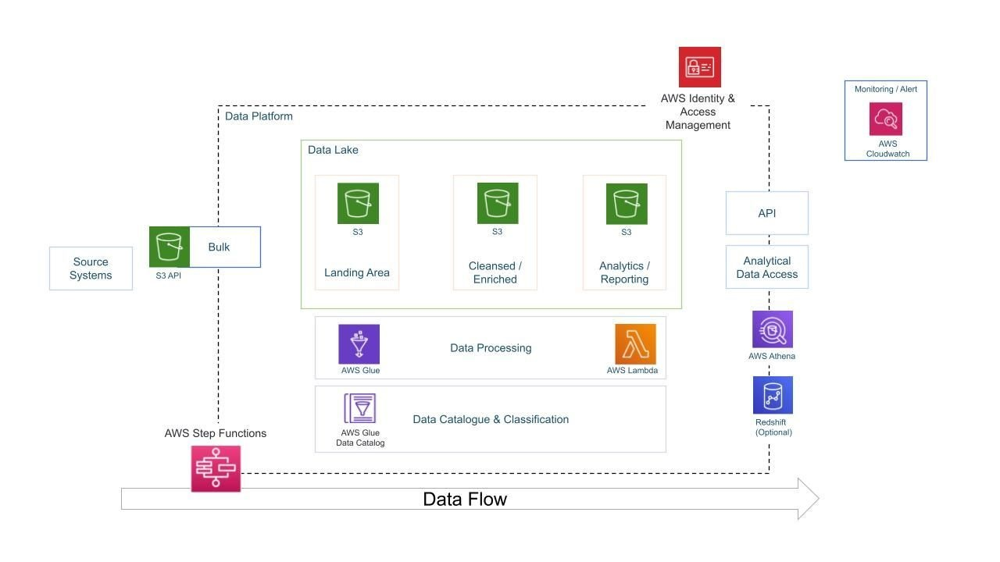

# 📊 YouTube Data Analysis - AWS Data Engineering Project

A complete data engineering project that ingests, cleans, analyzes, and visualizes YouTube trending video data using AWS cloud services. Inspired by Darshil Parmar and Project Pro, this project demonstrates a full data lake pipeline and analytics dashboard using a real-world dataset.

## 🎯 Project Goals

- **Data Ingestion**: Bulk ingest structured and semi-structured YouTube data into a data lake
- **ETL System**: Clean and transform raw CSV and JSON data using serverless services
- **Centralized Storage**: Use Amazon S3 as a scalable and durable data lake
- **Cloud-Based Scalability**: Leverage AWS managed services to scale effortlessly
- **Analytics & Visualization**: Enable ad-hoc queries using Athena and build visual dashboards in QuickSight

---

## 📁 Dataset

Dataset Source: [Kaggle - YouTube Trending Videos](https://www.kaggle.com/datasets/datasnaek/youtube-new)  
Description: Daily popular YouTube video stats by region, including views, likes, dislikes, category, title, tags, and more.

---

## 🧰 AWS Services Used

| Service       | Purpose |
|---------------|---------|
| **Amazon S3** | Landing zone and storage for raw, cleansed, and analytics-ready data |
| **AWS IAM**   | Access control and role-based permissions |
| **AWS Glue**  | Cataloging, transforming, and orchestrating ETL jobs |
| **AWS Lambda**| Lightweight serverless ETL transformations |
| **AWS Athena**| Interactive querying of data stored in S3 |
| **Amazon QuickSight** | Visual dashboard for trend analysis |

---

## 🔧 Implementation Steps

1. **Setup and Upload**
   - Created S3 buckets for landing, cleansed, and analytics zones
   - Uploaded regional CSV and JSON files to the landing zone

2. **Data Cataloging**
   - Built AWS Glue Crawler for raw data
   - Created Data Catalog to register schema

3. **Querying Raw Data**
   - Used Athena to explore uploaded data
   - Analyzed schema, anomalies, and transformation needs

4. **Data Transformation**
   - Wrote Lambda function to clean and normalize datasets
   - Stored cleansed data into separate S3 bucket partitions

5. **Cleansed Data Cataloging**
   - Ran another Glue Crawler on the transformed data
   - Updated catalog to reflect clean schema

6. **Querying Transformed Data**
   - Executed efficient SQL queries on cleaned data via Athena
   - Partitioning enabled faster analytics

7. **Visualization**
   - Built insightful dashboards using Amazon QuickSight
   - Filtered trends by region, category, and popularity metrics

---

## 📈 Key Insights Visualized

- Trending categories across countries
- Peak publishing days and times
- Correlation between likes, views, and comments
- Category-level performance

---

## 📚 Learning Outcomes

- Designed a scalable data pipeline using cloud-native tools
- Understood AWS Glue cataloging, partitioning, and job authoring
- Gained hands-on experience with Athena and QuickSight
- Followed a production-ready architecture used in real-world analytics systems

---

## 📎 Reference

Inspired by: [Darshil Parmar's YouTube AWS Project](https://www.youtube.com/watch?v=yZKJFKu49Dk)

---

## 🧠 Future Work

- Integrate real-time data ingestion with AWS Kinesis
- Implement data quality checks and alerts with AWS CloudWatch
- Use Redshift or Lake Formation for multi-source joins
